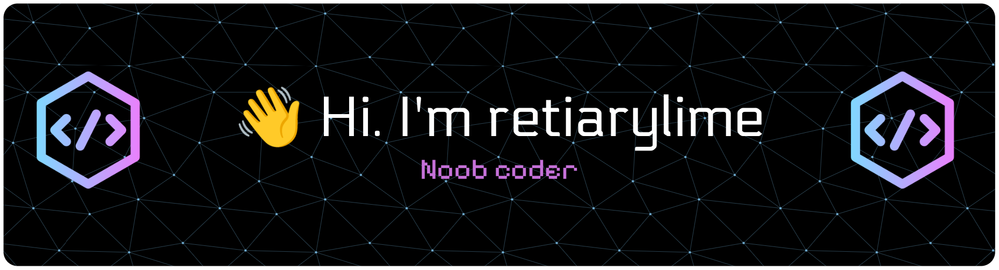

<!--
<h2 align="center">
  Welcome to retiarylime's World!
  
</h2>
-->

<!--

  

 -->

<!--  -->

<!-- Intro  -->
<h3 align="center">
        <samp>&gt; Hey There!, I am
                <b><a target="_blank" href="https://github.com/retiarylime">retiarylime</a></b>
        </samp>
</h3>

  <samp>
    「 90% AI, 10% pretending I knew it all along. 」
     
     
  </samp>

 <!--  -->
 <!--  -->
 <!--  -->
 <!--  -->
 <!--  -->

 

<!-- About Section -->
 # About me

 

 ✌️ Loves AI vibe coding as a hobby 
 🐧 A Linux enthusiast 
 🎓 Bachelor of Medicine and Bachelor of Surgery (MBBS) holder 
 📧 Text me anytime: retiarylime101@gmail.com 
 💬 Ask me about anything [here](https://github.com/retiarylime/retiarylime/issues)

 
 
 

## Technologies I Use

 

<!-- ## Top Projects -

 -->

  

  

 

 

  

  

<a>
    
  
   
</a>

  

